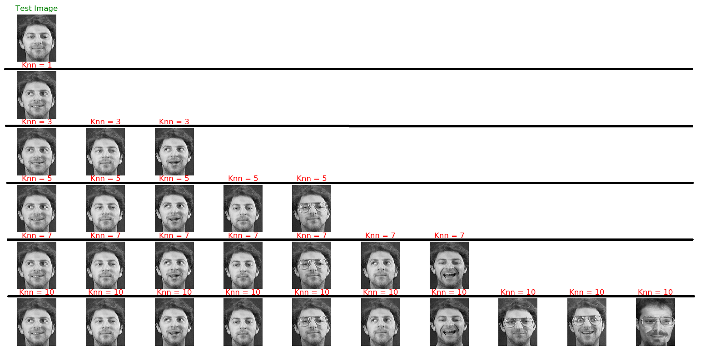

# Facial-Recognition-Using-CS_ALTP
Face recognition using adaptive local ternary patterns method / Wankou Yang, Zhenyu Wang ,Baochang Zhang
Tested on : ORL face database(Testset = 40 Pictures, Trainset = 360 Pictures), classifier -> KNN

CS-ALTP(4*4) 
Accuracy for Knn = 1 :
1. Accuracy(K=0.01) = 0.9750 
1. Accuracy(K=0.03) = 0.9750 
1. Accuracy(K=0.06) = 0.9750 
1. Accuracy(K=0.09) = 1.0000 
1. Accuracy(K=0.12) = 0.9750 
1. Accuracy(K=0.15) = 1.0000 
1. Accuracy(K=0.18) = 1.0000 
1. Accuracy(K=0.21) = 1.0000

.2
